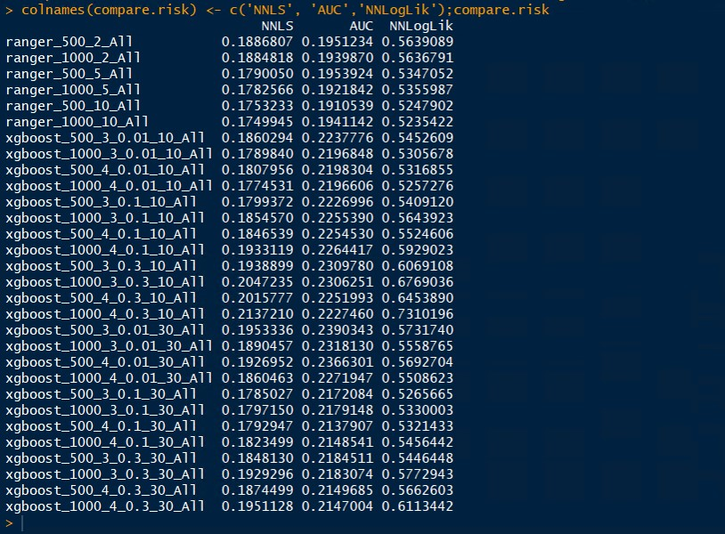

```{r setup, include=FALSE}
knitr::opts_chunk$set(echo = FALSE, message=FALSE, warning=FALSE)

if (!require('SuperLearner')) install.packages('SuperLearner'); library(SuperLearner)

```
In [Part 1](https://yungchou.wordpress.com/2018/12/12/data-preparation-of-diabetes-dataset-for-machine-learning/), I detailed the process to clean up and prepare the dataset, [Diabetes 130-US hospitals for years 1999-2008 Data Set](https://archive.ics.uci.edu/ml/datasets/diabetes+130-us+hospitals+for+years+1999-2008), downloaded from [UCI Machine Learning Repository](https://archive.ics.uci.edu/ml/index.php) for Macheine Learning.
To continue, this article described the framework and highlighted my steps to develop a Machine Learning model for predicting [hospital readmissions](https://www.cms.gov/medicare/medicare-fee-for-service-payment/acuteinpatientpps/readmissions-reduction-program.html). 

## Overview

At this time, I had selected a feature set based on the output from [Boruta](https://yungchou.wordpress.com/2018/11/19/feature-selection-with-help-from-boruta/) after a series of analysis and operations including data conversion and consolidation, imputation of data for missing values, etc. as detailed in [Part 1](https://yungchou.wordpress.com/2018/12/12/data-preparation-of-diabetes-dataset-for-machine-learning/).

By sampling and partitioning the data into three portions: 60% for training, 20% for testing and 20% hold for coss-validation, I used [SuperLearner](https://cran.r-project.org/web/packages/SuperLearner/index.html) to construct an ensemble learning model with a number of algorithms and eventually settled with [ranger](https://cran.r-project.org/web/packages/ranger/index.html) and [Extreme Gradient Boosting](https://cran.r-project.org/web/packages/xgboost/index.html) or xgboost. The whole development process took longer than expected, since it often took many hours and sometimes a day to run an ensemble model with testgrid (i,e, a configured set of tuning parameters) due to the complexity of and required computation for an ensemble model, in addition to a considerable amount of data.. 

```{r echo=FALSE, fig.cap="Local Laptop and Remove Azure Virtual Machine Computing Capacities", out.width = '75%', fig.align='center'}


```
The above schematic presented the computing hardware and configurations for the project. Throughout the development process, I mainly used my laptop, an **i7-3520M cpu** with **16 GB RAM**, to flush out incompability, instability and operational issues with prelinimary results by testing a configured model with relative small amount of data. And relied on [Microsoft Azure](https://azure.microsoft.com/en-us/services/virtual-machines/), namely cloud computing, for allocating sizable virtual machines with **8 vcpus** and **64 GB RAM** or above to test stablized models and tuning parameters with 20,000 observations or more. For testing various configurations, I ran my local laptop and an allocated remote VM ran independently.

The remaining article highlighted the logical steps and documented pertinent information.

## Data Set

Here, imported the data set which had 70245 observations of 27 variables with the following structure. The original data set downloaded and prepared in [Part 1](https://yungchou.wordpress.com/2018/12/12/data-preparation-of-diabetes-dataset-for-machine-learning/) had 101766 observations of 49 variable.

```{r}
df <- read.csv('data/capstone.dataimp.csv') # data set with Boruta selected fetures
df <- df[-1]

str(df)
```

## Class Imbalance

With the data set, I first noticed the label, **readmitted**, was with highly disproportional distribution of values. Out of 70245 observations, there were 65180 zeros and 5065 ones, almost thirteen times more zeros than ones. After sampling the label data and examining the distribution of values a few times, it was clear I needed to further prepared the data set.

```{r}
df$readmitted <- as.factor(df$readmitted)
table(df$readmitted)
cat('ratio ='
    ,table(df$readmitted)[1],'/',table(df$readmitted)[2]
    ,'=',table(df$readmitted)[1]/table(df$readmitted)[2]
    )
```

Considering 20,000 observations sampled from the data set as shown below. Which contained 17720 zeros (not readmitted) and 2280 ones (readmitted) of the label data. The imbalance was chacteristic when sampling various number of observations from the data set.**This imbalance was problematic, as such high class imbalance would likely overwhelme a model and lead to incorrect calssfication.** Since during training, the model would have learned much more about zeros and become prone to classifying the lable as 'not admitted', on the other hand known little about the stituations of ones and how to predict 'readmitted' scenarios. Consequently, a trained model would predict potentially with a high misclassification rate.

```{r}
set.seed(0-0)
df <- df[1:20000,]
table(df$readmitted)
cat('ratio ='
    ,table(df$readmitted)[1],'/',table(df$readmitted)[2]
    ,'=',table(df$readmitted)[1]/table(df$readmitted)[2]
    )
```
### SMOTE

To circumvent the imbalance isssue, I used [SMOTE](https://www.rdocumentation.org/packages/DMwR/versions/0.4.1/topics/SMOTE) to generate a "SMOTEd" set of values based on the label valyes with imbalance. The following code illustrated using SMOTE from the package, [Data Mining with R(DMwR)](https://cran.r-project.org/web/packages/DMwR/index.html), for generating a custom set of about 10,000 values for the label based on (i.e. derived from) df which contained 20,000 observations sampled from the data set. Notice the distributions and the amount of SMOTEd data of the two classes are configurable with **perc.over** and **perc.under** as detailed in [the documentation](https://www.rdocumentation.org/packages/DMwR/versions/0.4.1/topics/SMOTE). 

```{r echo=TRUE}
if (!require('DMwR')) install.packages('DMwR'); library(DMwR)

set.seed(0-0)

df.smote <- SMOTE(readmitted~., df, perc.over=100, perc.under=220)
table(df.smote$readmitted);cat(
    'Total observations =',table(df.smote$readmitted)[1]
    ,'+',table(df.smote$readmitted)[2],'=',nrow(df.smote)
    )
```
And the SMOTEd values was used as the label set of corresponding observations for training and testing.

```{r out.width='50%'}
  par(mfrow=c(1,2)
  );plot(df['readmitted'],las=1,col='lightblue'
         ,xlab='label(readmitted)',main=sprintf('Imported Data Set\n(%i obs.)',nrow(df))
  );plot(df.smote['readmitted'],las=1,col='lightgreen'
         ,xlab='label(readmitted)',main=sprintf('Employed SMOTEd Data\n(%i obs.)',nrow(df.smote))
  );par(mfrow=c(1,1))
```

## SuperLearner

For constructing an ensemble model, I used  [SuperLearner](https://cran.r-project.org/web/packages/SuperLearner/index.html) which provides a user-friendly framework and essentially eliminates the mechanics for orchestrating cross validation of each learner/algorithm from an ensemble developer. Here's a [tutorial](https://cran.r-project.org/web/packages/SuperLearner/vignettes/Guide-to-SuperLearner.html) to show how SuperLearner works. Notice that SuperLearner is a wrapper and algorithms included in ensemble must be installed first and required as libraries for envoking such algorithms.

Despite SuperLearner simplifies the mechanics for constructing, orchestrating and evaluating an ensemble model, it however does not substitute the need to understand how individual algorithms work, be familiar with the associated hyperparameters and the default settings. In fact, to develop an ensemble model I always start with running an individual algorithm by itsel in SuperLearner to get a preliminary understanding of how the algorithm behaves with the default settings before forming and tuning an ensemble model.  

### Algorithms/Learners

Hospital readmissions is a classifiction problem, since a patient is either readmitted or not. There have been a few algorithms known for solving classificaiton problems including [RandomForest](https://www.rdocumentation.org/packages/randomForest/versions/4.6-14/topics/randomForest), [Gradient Boosting](https://www.rdocumentation.org/packages/gbm/versions/2.1.4/topics/gbm), [Elastic Net](https://www.rdocumentation.org/packages/glmnet/versions/2.0-16), [Support Vector Machines](https://cran.r-project.org/web/packages/e1071/vignettes/svmdoc.pdf), [Neural Network](https://cran.r-project.org/web/packages/nnet/index.html) (nnet), etc. To develop ensemble learning, one important task at this time was to investigate and select a set of algorithms, or learners, complementry to one another to make predictions with high accuracy.

### Risk Assessments

SuperLearner provided three methods for evaluating risks, essentially errors, resulted from predictions made by an algorithm included in an ensemble model, then derived accordingly and assigned a coefficient/weight/importance to the algorithm. The methods were **NNLS, AUC, and NNloglik**, as described on page 6 of [her document](https://cran.r-project.org/web/packages/SuperLearner/SuperLearner.pdf).

### Ensemble and Tuning Parameters

Using SuperLearner, I first gathered candidate learners to form an ensemble and generated some preliminary results, assessed the baseline performance, and resolved operability and compatibility issues, if any. At the same time, ran the ensemble with tuning parameters or test grids to find optimal settings for individual learners.

### create.Learner

To create a test grid, I used **[create.Learner](https://cran.r-project.org/web/packages/SuperLearner/SuperLearner.pdf)**. As dmeonstrated below, for each algorithm to be called by SuperLearner, provided a range/set of values. create.Learner would reference/associate the settings with the algorithm and generate the funciton names. 
```{r}

```

```{r echo=TRUE,eval=TRUE}
#-----------
# Test Grid
#-----------
xgboost.custom <- create.Learner('SL.xgboost'
  ,tune=list(
    ntrees=c(500,1000) ,max_depth=4   # 1:4
   ,shrinkage=c(0.01,0.1) ,minobspernode=c(10,30)
   )
  ,detailed_names = TRUE ,name_prefix = 'xgboost'
)

ranger.custom <- create.Learner('SL.ranger'
 ,tune = list(
    num.trees = c(1000,1500)
#   ,mtry = floor(sqrt(ncol(x.train))*c(1,2))
   ,mtry = floor(sqrt(27)*c(1,2))
      )
 ,detailed_names = TRUE ,name_prefix = 'ranger'
)

glmnet.custom <-  create.Learner('SL.glmnet'
 ,tune = list(
   alpha  = seq(0 ,1 ,length.out=10)  # (0,1)=>(ridge, lasso)
  ,nlambda = seq(0 ,10 ,length.out=10)
   )
 ,detailed_names = TRUE ,name_prefix = 'glmnet'
)

```

And each function in this context was a designated algorithm with configured settings indicated by the function name. For example,

```{r echo=FALSE}
tail(ranger.custom$names,2
);tail(xgboost.custom$names,2
);tail(glmnet.custom$names,2)
```

To form an ensemble with the three algorithms, I simply included the function names generated by create.Learner as a library reference for SuperLearner which would fit the ensemble model by calling these functions.

```{r echo=TRUE, eval=FALSE}
SL.algorithm <- c(
  ranger.custom$names ,xgboost.custom$names ,glmnet.custom$names
  )

ensem.nnls <- SuperLearner(
   Y=y.train ,X=x.train ,verbose=TRUE
  ,family=family ,method=nnls ,SL.library=SL.algorithm
  )

ensem.nnls.cv <- CV.SuperLearner(Y=y.hold ,X=x.hold ,verbose=TRUE
  ,cvControl=list(V=nfold) ,parallel=cl
  ,family=family ,method=nnls ,SL.library=SL.algorithm
  )
```

Based on the specified evaluation method, here nnls, SuperLearner ranked the importance of each learner by deriving and assigning a coefficient or weight, as illustrated by the following plot. And the smaller the coefficient, the less on average the algorithm would be expected to contribute to a prdiction made by the ensemble. Here, a coefficient with zero indicated SuperLearner's removal of the associated algorithm from an associated ensemble.

```{r echo=FALSE, fig.cap='', fig.align='center', out.width='100%'}
if (!require('plotly')) install.packages('plotly'); library(plotly)

# This is a test previously run and imported here for demo
ensem.nnls.glmnet <- readRDS('ensem.nnls.glmnet.removal')
x.train.glnmet <- 322

(p2d.method.risk <- plot_ly(as.data.frame(
  cbind(ensem.nnls.glmnet$cvRisk,ensem.nnls.glmnet$coef))
  ,type='scatter',mode = 'markers'
  #,width=1600 ,height=900 #,margin=5
  ,x = ~ensem.nnls.glmnet$libraryNames 
  ,y = ~ensem.nnls.glmnet$cvRisk ,name='risk'
  ,hoverinfo = 'text' ,text = ~paste(
    'learner:' ,ensem.nnls.glmnet$libraryNames
   ,'\nrisk:' ,ensem.nnls.glmnet$cvRisk)
  ,marker=list( size = 10, opacity = 0.5
                ,line=list( color='black' ,width=1
                #,shape='spline' ,smoothing=1.3
                ))
) %>% add_trace(y = ~ensem.nnls.glmnet$coef, name='coefficient',yaxis='y2'
                ,hoverinfo = 'text' ,text = ~paste(
                  'learner:' ,ensem.nnls.glmnet$libraryNames
                  ,'\ncoefficient:' ,ensem.nnls.glmnet$coef)
) %>% layout( title=sprintf(
   "Ricks and Coefficients Based on Tuning Parameters (SMOTE'd Training Data = %i obs.)", x.train.glnmet)
  ,xaxis=list(title='')
  ,yaxis=list(title='risk'
              #,range=c(min(ensem.nnls$cvRisk),max(ensem.nnls$cvRisk)+0.1)
              )
  ,yaxis2=list(title='coefficient' #
               #,range=c(min(ensem.nnls$coef),max(ensem.nnls$coef)+0.1)
               ,overlaying='y' ,side='right')
#  ,margin=list(l=0, r=0, b=10, t=10, pad=5)
  ,plot_bgcolor='rgb(250,250,250)'
))
```

Along the process, SuperLearner ruled out an algorithm with high risk by assigning a small or zero as the coefficients/weights, which essentially would remove the algorithms from contributing to making predicitons. And eventually I settled to the two most stable and best performed algorithms, ranger and xgboost, in all test runs for constructing an ensemble.

## Ensemble Learning

Relevant to Machine Learning, an ensemble combines the predictions from multiple algorithms to make predictions more accurate than that of those predicted by an individual algorithm.

For a complex problem like hospital readmissions, realizing and optimizing [biases-variance tradeoff](http://www.cs.cornell.edu/courses/cs4780/2017sp/lectures/lecturenote11.html) is a challenge. And using ensemble learning to complement some algorithms' weakness with the others' strength by evaluating, weighting, combining, and optimizing their results seemed a right strategy and logical approach. The following illustrated the concept of ensemble learning and additional informaiton is available at the source.

](img/ensemble-learning-concept.png)

## R Parallel Processing

Speaking from my experience, a few inital tests I did when first composing ensemble models were painfully long using an Azure virtual machine (VM) with 8 vcpus and 64 GB RAM. And those tests were just with a few thousand observations which I thought 8 vcpus/64 GB RAM would have been sufficient to produce results within an hour or two. Those supposely small scale and short tests went for hours after hours. I realized that the generated functions and iterations for hyperparameters and cross validation were highly repeatitive and ideal for parallel processing. Hence I needed computing capacity to not only run the ensemble, but run it in parallel when possible, to keep the development process manageable with time. 

### SNOW 

The approach of parallel computing is in general three-fold: 

- First segment a problem into smaller, self-contained, and manageable pieces. 
- Then solve these pieces in parallel. 
- And finally process individual results back together and present the results. 

There appeared quite a few packages for enabling parallel parallel processing in R, most are wrappers and ultimately fell in either '**multicore**' or '**snow**' system. And the package, [**parallel**](https://stat.ethz.ch/R-manual/R-devel/library/parallel/doc/parallel.pdf), was essential. My computing environment was Windows, therefore SNOW clusters were applicable. To minimize the complexity, instead of among multiple hosts I ran parallel processing in a single host, namely with multiple cpus either in my laptop or an allocated Azure VM independently.

The following is one sample configuration for training one ensemble in parallel. It ran all three SuperLearner evaluation methods, namely [NNLS](https://en.wikipedia.org/wiki/Non-negative_least_squares), [AUC](https://developers.google.com/machine-learning/crash-course/classification/roc-and-auc) and [NNloglik](), and completed the training with 9576 observations in 5 hours using the aformentioned i7 laptop (i.e. 3 vcpus and 16 GB RAM) in parallel processing.

```{r eval=FALSE, echo=FALSE}
if (!require('parallel')) install.packages('parallel'); library(parallel)

# Create a cluster using most CPUs
cl <- makeCluster(detectCores()-1)

# Export all references to cluster nodes
clusterExport(cl, c( listWrappers()

  ,'SuperLearner','CV.SuperLearner','predict.SuperLearner'
  ,'nfold','x.train','y.train','x.test','y.test','x.hold','y.hold'
  ,'family','nnls','auc','nnloglik'

  ,'SL.algorithm'
  ,ranger.custom$names,xgboost.custom$names

  ))

# Set a common seed for the cluster
clusterSetRNGStream(cl, iseed=135)

## Load libraries on workers
clusterEvalQ(cl, {
  library(SuperLearner);library(caret)
  library(ranger);library(xgboost)
})

# Run training session in parallel
clusterEvalQ(cl, {

  ensem.nnls <- SuperLearner(Y=y.train ,X=x.train
    ,family=family ,method=nnls ,SL.library=SL.algorithm
    );saveRDS(ensem.nnls ,'ensem.nnls')

})

# Do cross validation in parallel
system.time({
  ensem.nnls.cv <- CV.SuperLearner(Y=y.hold ,X=x.hold
    ,cvControl=list(V=nfold) ,parallel=cl
    ,family=family ,method=nnls ,SL.library=SL.algorithm
    );saveRDS(ensem.nnls.cv ,'ensem.nnls.cv')
  })

#  the cluster
stopCluster(cl)

```

## Developing Ensemble Learning

Due to the complexity of the ensemble model and the amount of data, a training with about 5,000 observations in my case could take a few hours with a parallel processing using 3 vcpus of an Intel i7-3520M laptop with 16 GB RAM. 

Prior to these test runs, I would document and conduct a dozen of small tests with just a few hundred observations to smooth out the operations and verify if a configuration would format an output properly and generate what I needed.

The process was highly iterative and I spent most of the time fine-tuning the model, plotting the results, examining the output, etc. back and forth to ensure operability and integrity of a model. Eventually, the process gravitated to a set of configurations and associated parameters to from the ensemble model which I used as a template to generate many of the output presneted in this article. While not necessarily presented in order, the following highlights the development process continued from [the data preparation](https://yungchou.github.io/site/).  

- Creating a better-balanced data distribution of the label, as applicable
- Partitioning data for training and testing
- Building and deriving a set configuration for generating outputs
- Stablizing the configuration, tuning and improving the model

[Ensemble Learning](https://www.analyticsvidhya.com/blog/2015/08/introduction-ensemble-learning/) is an important vehicle for achieving and improving results for problems of many variables with complex correlation such that the effects of [bias and variance trade-off](https://data-science-blog.com/blog/2017/12/03/ensemble-learning/) may not be evident. While oversimplifying the approach, an ensemble learning is to employ, evaluate, and compose results from multiple learners operating on the same data set to make better predictions than those derived from each and a single algorithm individually.

In this project, I used Ranger and xgboost to form an ensemble learning model. [Ranger](https://cran.r-project.org/web/packages/ranger/index.html) is an implementation of Random Forest, particularly suited for high
dimensional data. At the same time, [xgboost](https://cran.r-project.org/web/packages/xgboost/index.html) (or Extreme Gradient Boosting) enhances gradient boosting algorithm and supports parallel processing. Both are solid algorithms for regression and classification problems. Interestingly, both algorithms themselves also use ensemble learning to product results.

Below is a compilation of the ensembles genereated by the aforementioned cutom learners, ranger.custom and xgboost.custom, and their associated errors or risks reported for a test run. The name indicated the algorithm and the configured hyperparameters. For instance, ranger_500_2_All denoted Ranger with num.trees=500 and mtry=2 where 'All' revealed that all features were included, i.e. without screening features for correlation. And xgboost_1000_3_0.01_10_All depicted using xgboost algorithm with ntrees=1000, max_depth=3, shrinkage=0.01 and minobspernode=10. All applicable ensembles were processed through 10-fold cross validation as the default.

```{r echo=FALSE, fig.cap="", out.width = '75%', fig.align='center'}


```

```{r}

```

## Next

Once a model is stablized, there are fundamental ways to futher investigate and possibly improve the performance:

- Increasing the training data
- Increase the cross validation fold
- Fine tune hyperparameters
- Experiment various feature set

## Cloding Thoughts

- Building ensembles

As stated earlier, SuperLearner helps construct, orchestrat and evaluate an ensemble model, it however does not suggest we no longer need to understand the logic of individual algorithms and how to operate the associated hyperparameters. Personally, I always start with running individual algorithm by itsel in SuperLearner to get a preliminary understanding of how the algorithm behaves with the default settings to first take care of operations or stability issues, if any, before forming an ensemble model with multiple algorithms. For me, this initial investiment of time pays off generously with productivity along the development process.

- ranger

In my experience, **ranger** produces appears producing results faster than Random Forest overall and I have since then adopted the former as the de facto random forest algorithm to use.

- xgboost

These days **xgboost** has established a reputation for making better predicitons and been inreasingly employed in many data science competitions.([1](https://medium.com/syncedreview/tree-boosting-with-xgboost-why-does-xgboost-win-every-machine-learning-competition-ca8034c0b283),[2](https://www.kdnuggets.com/2017/10/xgboost-top-machine-learning-method-kaggle-explained.html),[3](https://towardsdatascience.com/how-i-got-in-the-top-1-on-kaggle-79ddd7c07f1c)) In this project and with my configuration, xgboost nevertheless did not deliver any dramatically different from what was from ranger. Still, the role of xgboost in a Machine Learning model is becoming essential, in my opinion. 

